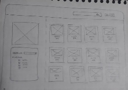

# Data Lovers

## Índice

* [1. Definición del producto](#1-definición-del-producto)
* [2. Resumen del proyecto](#2-resumen-del-proyecto)
* [3. Historias de usuario](#3-historias-de-usuario)
* [4. Diseño de la interfaz de usuario](#4-diseño-de-la-interfaz-de-usuario)

***

## 1. Definición del producto

Pokemon Go _La Colección _ es una aplicación dirigida a todxs aquellxs “Maestrxs Pokémon” que necesiten consultar con facilidad la información más importante acerca de los pokemón de su interés dentro de las regiones Kanto y Johto.

## 2. Resumen del proyecto

Esta aplicación les permitirá ordenar a los 251 pokémon de estas regiones por orden alfabético o por número de pokédex. El usuario podrá definir si el orden se dará de manera ascendente (de la A a la Z o del 001 al 251) o descendiente (de la Z a la A o del 251 al 001).

Además, el usuario podrá aplicar dos filtros para que su búsqueda sea más rápida:

* Filtro por Tipo Pokémon: Este filtro hará que sólo se muestren en     pantalla los pokémon que pertenezcan a los tipos seleccionados por el usuario:
Planta, Fuego,  Agua, Normal, Eléctrico, Bicho, Volador, Veneno, Roca, Tierra, Fantasma, Psíquico, Acero, Lucha, Hielo, Dragón, Siniestro, Hada.
Se puede seleccionar más de una opción para filtro por Tipo Pokémon a la vez.

* Filtro por Número de Debilidades: Este filtro hará que se muestren en pantalla únicamente los pokémon que tengan la cantidad de debilidades que el usuario seleccione: Pokémon con 1, 2, 3, 4, 5, 6 o 7 debilidades.
Se puede seleccionar más de una opción para filtro por Número de Debilidades a la vez.

La aplicación permite combinar el uso de ambos filtros en una misma búsqueda. Esto podría resultar muy útil cuando unx Entrenadxr Pokémon conoce las debilidades del pokemon de su oponente y desea saber cuáles de sus pokemons son de los tipos Pokemon que coinciden con las debilidades del pokemon oponente y dentro de estas opciones cuál pokémon tiene menos debilidades para enfrentarse a los próximos pokemons del oponente dentro del mismo duelo.

## 3. Historias de usuario

Se trabajó con las siguientes historias de usuario:

* Yo como jugador de Pokémon quiero ver en el navegador todos los pokémon para descubrir nuevos pokémon y conocer sus características
* Yo como jugador de Pokémon quiero filtrar los Pokémon por su tipo para poder ver seleccionarlos por esta característica.
* Yo como jugador de Pokémon quiero filtrar los Pokémon por su cantidad de debilidad para poder ver los pokemones que me interesan.
* Yo como jugador de Pokemon quiero filtrar los Pokémon por su nombre para poder conocer sus características individualmente.

## 4. Diseño de la interfaz de usuario

### Prototipos de baja fidelidad

Se realizaron dos prototipos por cada una de las integrantes del equipo. Los prototipos simulaban pantallas de dos dispositivos: móvil y escritorio. Cada uno fue testeado (hasta dos personas por prototipo). Estos test se basaron en la técnica de guerrilla testing para poder realizar un análisis rápido y obtener feedback sobre el diseño de la interfaz. Los participantes manifestaron interés en el tema del producto (Pokémon). Después de los test se utilizaron las recomendaciones y feedback de los entrevistados para realizar un prototipo digital.

Parte de los prototipos utilizados en este proceso para la primera y segunda historia de usuario, se muestran a continuación.

### Prototipos de alta fidelidad

Una vez que se acordaron las recomendaciones que se incluirían en los prototipos (móvil y escritorio), se seleccionaron los elementos que formarían parte del diseño de la interfaz: paleta de colores, tipo de fuente y assets. Los prototipos fueron realizados de forma colaborativa con la herramienta Figma.

Prototipos de alta fidelidad para mobile y desktop.

* [Figma](https://www.figma.com/file/cSAXUkhQYHVaoz5X3GkzI7/DataLovers-prototipo?node-id=0%3A1)

* [Zeplin](https://zpl.io/blQQrlX)
